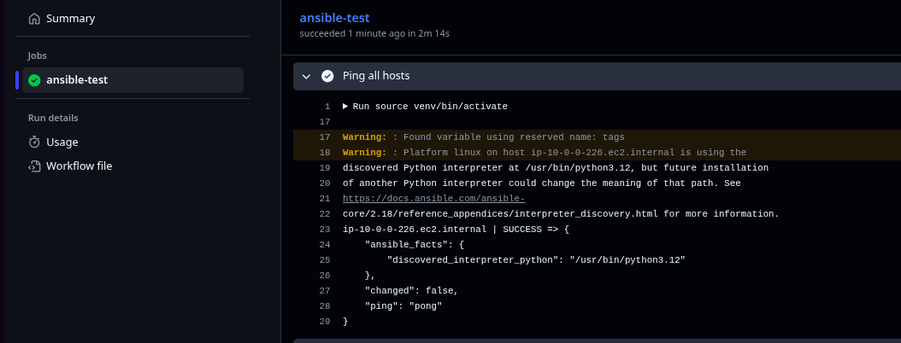
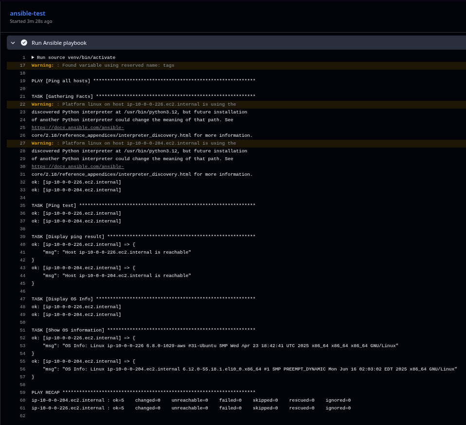

# Ansible Elastic Inventory (AEI)

AEI is a mini project that demonstrates how to use **Ansible** with a **dynamic inventory** sourced from **AWS EC2 instances**. It's designed to be lightweight, beginner-friendly, and easy to extend.

[](https://github.com/akash2061/Ansible-Elastic-Inv/actions/workflows/ansible-test.yml)

## 🎯 Overview

This project showcases how to manage AWS EC2 instances dynamically using Ansible. Instead of maintaining static inventory files, it automatically discovers and groups EC2 instances based on their tags and properties. The project includes:

- Dynamic inventory configuration for AWS EC2
- OS-specific package management
- Nginx deployment on Ubuntu instances
- Flexible playbook structure for different scenarios

## 🔧 Prerequisites

Before using this project, ensure you have:

- **Ansible** (version 2.1 or higher)
- **Python 3.6+**
- **AWS CLI** configured with appropriate credentials
- **boto3** and **botocore** Python packages
- **amazon.aws** Ansible collection
- **AWS IAM User/Role** with appropriate permissions

### Required AWS IAM Permissions

#### Recommended IAM Policy:
For better functionality, attach the **AmazonEC2FullAccess** `[For Learning/Testing Purpose]` managed policy to your IAM user/role.

#### Creating an IAM User for Ansible:
1. Go to AWS IAM Console
2. Create a new user (e.g., `ansible-user`)
3. Attach the policy `AmazonEC2FullAccess`
4. Generate Access Keys for programmatic access
5. Use these credentials in your AWS CLI configuration

### Required Ansible Collections

```bash
ansible-galaxy collection install amazon.aws
```

### Required Python Packages

```bash
pip install boto3 botocore
```

## 📁 Project Structure

```
Ansible-Elastic-Inv/
├── ansible.cfg                    # Ansible configuration
├── aws_ec2.yaml                   # Dynamic inventory configuration
├── README.md                      # This file
├── group_vars/                    # Group-specific variables
│   ├── os_rhel.yml                # RHEL/CentOS specific variables
│   └── os_ubuntu.yml              # Ubuntu specific variables
├── playbooks/                     # Ansible playbooks
│   ├── package.yml                # Package installation playbook
│   ├── ping.yml                   # Connectivity test playbook
│   └── roles.yml                  # Role-based deployment playbook
└── roles/                         # Ansible roles
    └── nginx_on_ubuntu/           # Nginx deployment role for Ubuntu
        ├── README.md              # Role documentation
        ├── files/
        │   └── index.html         # Custom HTML file
        ├── meta/
        │   └── main.yml           # Role metadata
        └── tasks/
            └── main.yml           # Role tasks

8 directories, 12 files
```

## 🚀 Installation & Setup

1. **Clone the repository:**
   ```bash
   git clone https://github.com/akash2061/Ansible-Dynamic-Inv.git
   cd Ansible-Dynamic-Inv
   ```

2. **Configure AWS credentials:**
   ```bash
   aws configure
   ```
   Or set environment variables:
   ```bash
   export AWS_ACCESS_KEY_ID="your-access-key"
   export AWS_SECRET_ACCESS_KEY="your-secret-key"
   export AWS_DEFAULT_REGION="ap-south-1"  # Optional & for default Settings
   ```

3. **Set up SSH key:**
   - Place your EC2 key pair in `~/.ssh/key.pem`
   - Ensure proper permissions: `chmod 400 ~/.ssh/key.pem`

4. **Tag your EC2 instances:**
   Your EC2 instances should have the following tags:
   - `OS`: `ubuntu` or `rhel`
   - `User`: SSH username (e.g., `ubuntu`, `ec2-user`)

## ⚙️ Configuration

### Dynamic Inventory Configuration (`aws_ec2.yaml`)

The dynamic inventory is configured to:
- Query EC2 instances in `ap-south-1` and `us-east-1` regions [Multi Region]
- Group instances by OS type (`os_ubuntu`, `os_rhel`)
- Group instances by user (`user_ubuntu`, `user_ec2-user`)
- Only include running instances
- Use public IP addresses for connection

### Ansible Configuration (`ansible.cfg`)

Basic Ansible configuration that sets the roles path to the local `./roles` directory.

## 🎮 Usage

### Test Dynamic Inventory

```bash
# List all discovered hosts
ansible-inventory -i aws_ec2.yaml --list

# List hosts in a specific group
ansible-inventory -i aws_ec2.yaml --list --limit os_ubuntu
```

### Run Playbooks

```bash
# Test connectivity to all hosts
ansible-playbook -i aws_ec2.yaml playbooks/ping.yml

# Install packages on all hosts
ansible-playbook -i aws_ec2.yaml playbooks/package.yml

# Deploy Nginx on Ubuntu hosts
ansible-playbook -i aws_ec2.yaml playbooks/roles.yml
```

### Target Specific Groups

```bash
# Run on Ubuntu hosts only
ansible-playbook -i aws_ec2.yaml playbooks/package.yml --limit os_ubuntu

# Run on RHEL hosts only
ansible-playbook -i aws_ec2.yaml playbooks/package.yml --limit os_rhel
```

## 📚 Playbooks

### 1. `ping.yml` - Connectivity Test
- Tests connectivity to all discovered hosts
- Displays OS information
- Useful for verifying dynamic inventory setup

### 2. `package.yml` - Package Installation
- Installs OS-specific packages defined in group variables
- Demonstrates conditional tasks based on OS family
- Uses the `ansible.builtin.package` module for cross-platform compatibility

### 3. `roles.yml` - Role-based Deployment
- Applies the `nginx_on_ubuntu` role to Ubuntu instances
- Demonstrates role-based automation

## 🎭 Roles

### `nginx_on_ubuntu`

A role that deploys Nginx web server on Ubuntu instances:

**Tasks:**
- Installs Nginx using apt
- Copies custom HTML file to web root
- Ensures Nginx service is running and enabled

**Files:**
- `index.html`: Custom welcome page

**Requirements:**
- Target host must be Ubuntu/Debian-based
- Requires sudo privileges

## 📊 Group Variables

### `os_ubuntu.yml`
- Packages: `git`, `htop`
- SSH user: Derived from instance tags
- SSH key: `~/.ssh/key.pem`

### `os_rhel.yml`
- Packages: `git`, `nginx`
- SSH user: Derived from instance tags
- SSH key: `~/.ssh/key.pem`

## 💡 Examples

### Example 1: Check Inventory
```bash
ansible-inventory -i aws_ec2.yaml --graph
```

### Example 2: Run Ad-hoc Commands
```bash
# Check uptime on all hosts
ansible -i aws_ec2.yaml all -m command -a "uptime"

# Check disk space on Ubuntu hosts
ansible -i aws_ec2.yaml os_ubuntu -m command -a "df -h"
```

### Example 3: Custom Playbook Run
```bash
# Run with increased verbosity
ansible-playbook -i aws_ec2.yaml playbooks/package.yml -vvv

# Run with specific user
ansible-playbook -i aws_ec2.yaml playbooks/package.yml --user ubuntu
```

## 📸 Screenshots

### Dynamic Inventory


### Single Host Ping Test


### Multi-Host Ping Test


### Running Playbooks


### Multi-Host PlayBook Execution


### Package Installation and Roles


### Nginx Test Page


## 🔍 Troubleshooting

### Common Issues

1. **No hosts found:**
   - Verify AWS credentials are configured
   - Check if EC2 instances are running
   - Ensure instances have proper tags

2. **SSH connection failed:**
   - Verify SSH key path and permissions
   - Check security groups allow SSH (port 22)
   - Ensure correct username in instance tags

3. **Permission denied:**
   - Verify SSH key corresponds to EC2 instance key pair
   - Check if user has sudo privileges for tasks requiring elevation

### Debug Commands

```bash
# Validate inventory syntax
ansible-inventory -i aws_ec2.yaml --list --yaml

# Test SSH connectivity
ansible -i aws_ec2.yaml all -m ping --ask-pass
```

## 🤝 Contributing

1. Fork the repository
2. Create a feature branch (`git checkout -b feature/new-feature`)
3. Commit your changes (`git commit -am 'Add new feature'`)
4. Push to the branch (`git push origin feature/new-feature`)
5. Create a Pull Request

## 📝 License

This project is licensed under the MIT License - see the [LICENSE](LICENSE) file for details.

## 👤 Author

**akash2061 (morningstar_2061)**
- GitHub: [@akash2061](https://github.com/akash2061)

---

⭐ **Star this repository if you find it helpful!**
